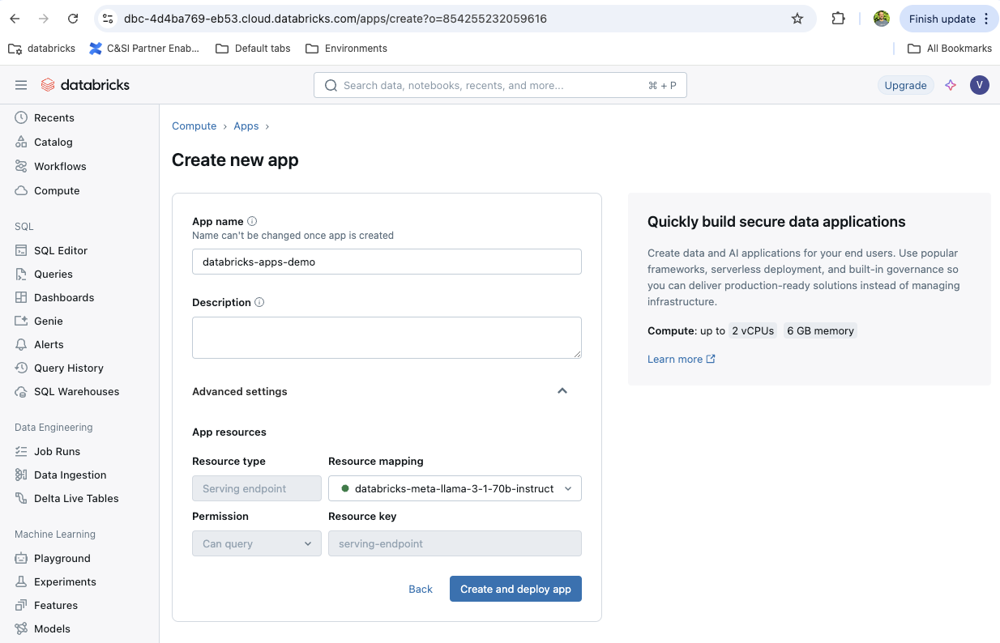
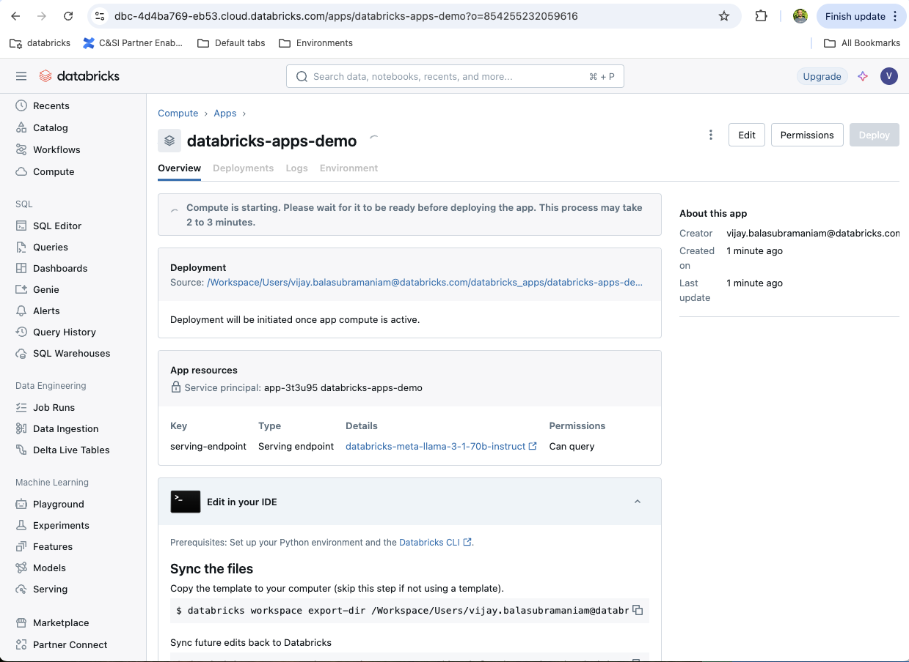
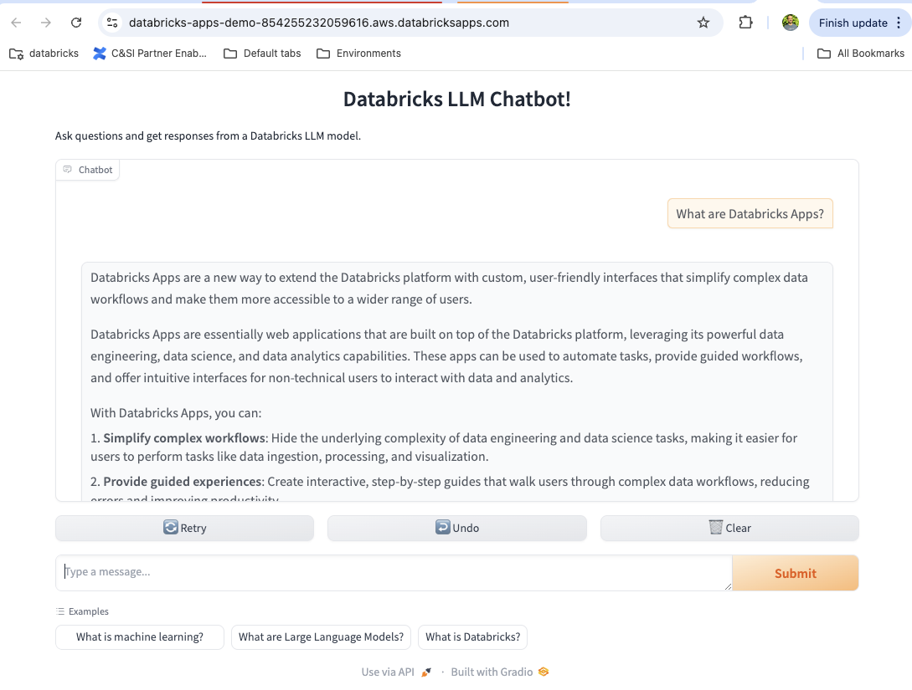
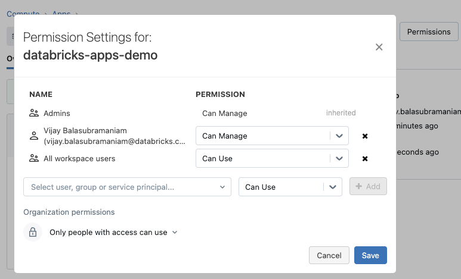

# databricks-apps-demo

This is a simple Gradio chatbot application that is running in a Lighthouse workspace.

#### Step 1: Create a new app

Go to Compute --> Apps and choose Create New App. Pick a template, and choose Gradio-->Chatbot.



#### Step 2: Configure the app



Set the following environment variables in `.env`

1. DATABRICKS_CONFIG_PROFILE
2. SERVING_ENDPOINT (eg. databricks-meta-llama-3-1-70b-instruct)

#### Step 3: Copy the template to your computer

Follow the instructions to copy the template to your computer

Run `./copy-to-local.sh`

#### Step 4: Create a local virtual environment

`python -m venv venv`

Activate the environment and install dependencies into it

```bash
source venv/bin/activate
pip install -r requirements.txt
```

#### Step 5: Run the app locally

`python app.py`

You can access the app by pointing your browser to http://127.0.0.1:7860


#### Step 6: Make changes to the app locally

Start with a minor change (eg. adding ! to the title)

#### Step 7: Sync your changes to the workspace

`./sync.sh`

#### Step 8: Deploy the app

Before you do this, make sure your Databricks CLI is upgraded to the latest version (v0.230.0 or newer)

`./deploy.sh`

If successful, you should see something like the following:

```json
{
  "create_time":"2024-10-14T19:29:06Z",
  "creator":"vijay.balasubramaniam+lighthouse@databricks.com",
  "deployment_artifacts": {
    "source_code_path":"/Workspace/Users/cea17c34-53ee-47c0-b583-e0370022663b/src/01ef8a6293bf1d798a5a813cf7bcc6c2"
  },
  "deployment_id":"01ef8a6293bf1d798a5a813cf7bcc6c2",
  "mode":"SNAPSHOT",
  "source_code_path":"/Workspace/Users/vijay.balasubramaniam@databricks.com/databricks_apps/databricks-apps-demo_2024_10_14-18_46/gradio-chatbot-app",
  "status": {
    "message":"App started successfully",
    "state":"SUCCEEDED"
  },
  "update_time":"2024-10-14T19:29:10Z"
}
```

#### Step 9: Test the deployed app

You can get the URL from the Databricks UI (Compute-->Apps-->Overview-->Running)

https://databricks-apps-demo-854255232059616.aws.databricksapps.com/




#### Step 10: Grant permissions to additional users

By default, only the app creator and admins can access the app. If appropriate, grant "All workspace users" the "Can Use" permission.


