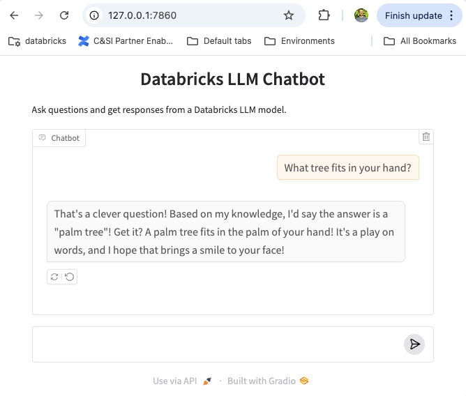

# databricks-apps-demo

This is a simple Gradio chatbot application that is running in a Lighthouse workspace.

#### Step 1: Create a new app

Go to Compute --> Apps and choose Create New App. Pick a template, and choose Gradio-->Chatbot.


#### Step 2: Configure the app


Set the following environment variables in `.env`

1. DATABRICKS_CONFIG_PROFILE
2. SERVING_ENDPOINT (eg. databricks-meta-llama-3-1-70b-instruct)

#### Step 3: Copy the template to your computer

Follow the instructions to copy the template to your computer

Run `./copy-to-local.sh`

#### Step 4: Create a local virtual environment

`python -m venv venv`

Activate the environment and install dependencies into it

```bash
source venv/bin/activate
pip install -r requirements.txt
```

#### Step 5: Run the app locally

`python app.py`

You can access the app by pointing your browser to http://127.0.0.1:7860



